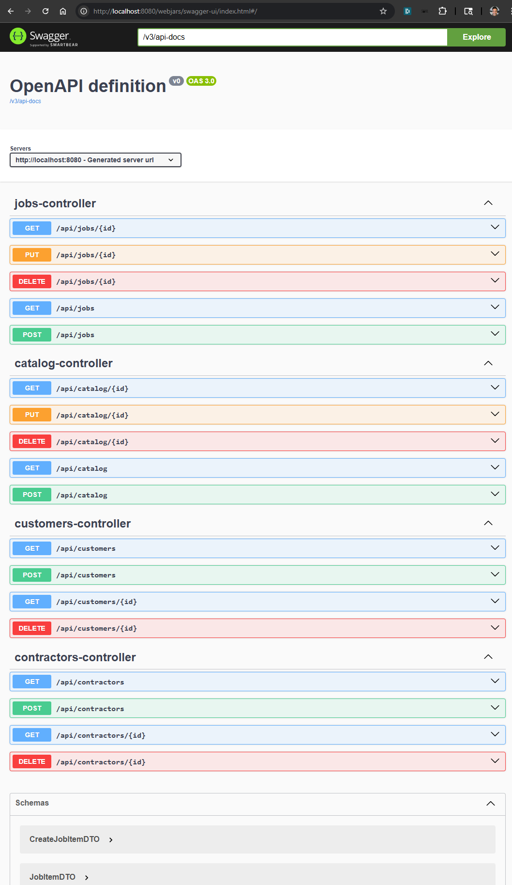
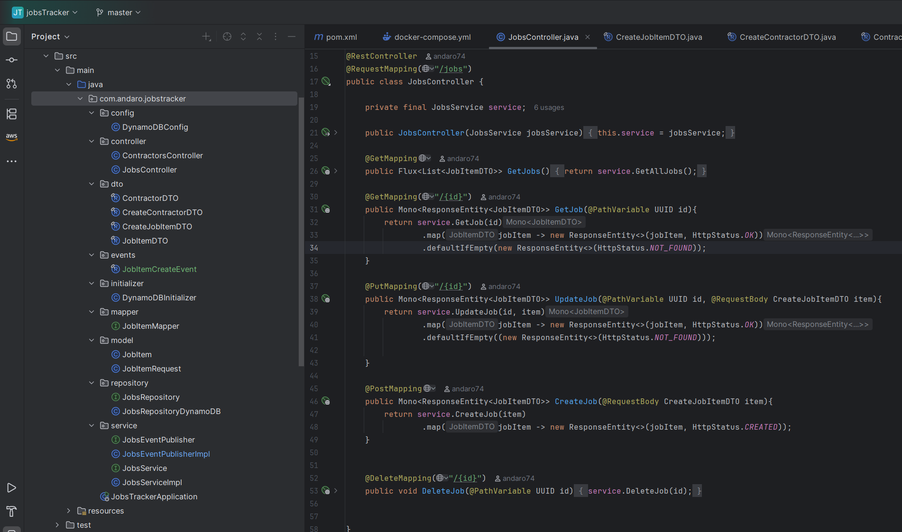
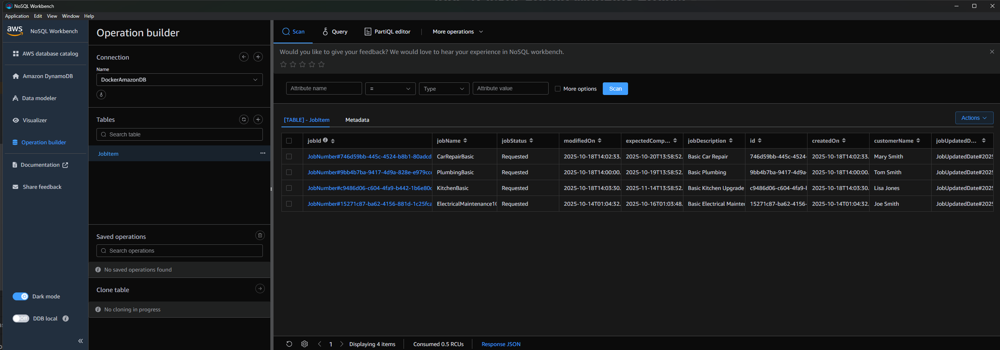
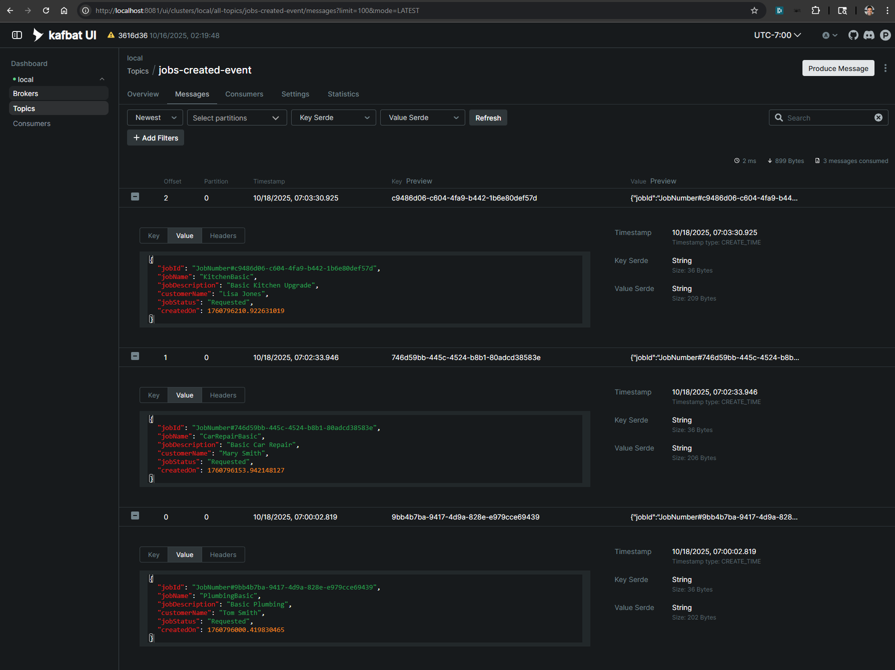
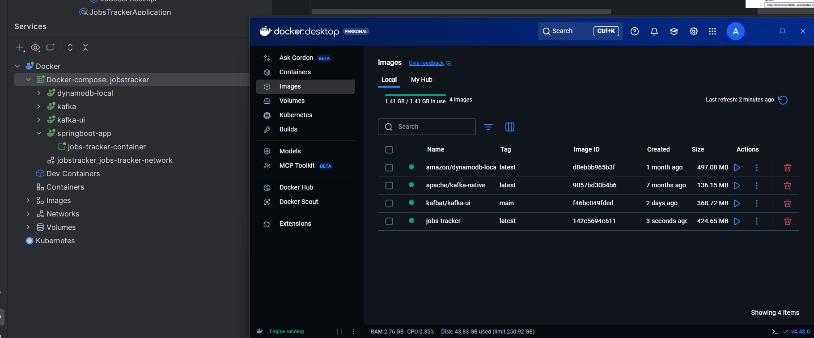

## Jobs Tracker Spring WebFlux Project

Demonstrate a Jobs Tracker REST application via Spring WebFlux, DynamoDB and Kafka.

### ID Conventions

This API uses **string business identifiers** for all domain objects instead of raw UUIDs:

- `customerId` (String): customer identifier, e.g. `CUST-0001` or a ULID-like string.
- `catalogId` (String): catalog identifier, e.g. `CAT-0001`.
- `contractorId` (String): contractor identifier, e.g. `CON-0001`.
- `jobId` (String): job identifier, e.g. `JOB-0001`.

DynamoDB PK/SK values derive from these IDs (e.g. `CUSTOMER#<customerId>`). The REST API never exposes PK/SK values directly.

### REST APIs

#### Customers (`/api/customers`)

| Method | Path | Required body fields |
| --- | --- | --- |
| POST | `/api/customers` | `CustomerRequest` with: `firstName`, `lastName`, `address`, `city`, `state`, `zipCode`, `emailAddress`, `phoneNumber`. Optional: `address2`, `country`, `companyName`. |
| PUT | `/api/customers/{customerId}` | Same schema as POST (all fields required by validation). |

Other endpoints:
- `GET /api/customers/{customerId}`
- `DELETE /api/customers/{customerId}`
- `GET /api/customers`
- `GET /api/customers/search?firstName&lastName&zipCode&phoneNumber&emailAddress` (at least one filter required).

Example create payload:

```json
{
  "firstName": "Jane",
  "lastName": "Doe",
  "address": "123 Main St",
  "address2": "Suite 100",
  "city": "Austin",
  "state": "TX",
  "zipCode": "78701",
  "country": "US",
  "emailAddress": "jane@example.com",
  "phoneNumber": "555-123-4567",
  "companyName": "Doe Electric"
}
```

#### Catalog (`/api/catalog`)

| Method | Path | Required body fields |
| --- | --- | --- |
| POST | `/api/catalog` | `CreateCatalogDTO` with: `catalogName`, `catalogDescription`, `price`, `tradeType`, `priceRateType`. |
| PUT | `/api/catalog/{catalogId}` | `UpdateCatalogDTO` (all fields optional, only non-null/non-blank values applied): `catalogDescription`, `price`, `tradeType`, `priceRateType`. |

Other endpoints:
- `GET /api/catalog`
- `GET /api/catalog/{catalogId}` (requires string `catalogId`)
- `DELETE /api/catalog/{catalogId}`

`priceRateType` accepts enumerated values such as `PER_JOB`, `HOURLY`, `MONTHLY`, `YEARLY`, etc. When a value is missing, services default to `PER_JOB` for DynamoDB records.

#### Contractors (`/api/contractors`)

| Method | Path | Required body fields |
| --- | --- | --- |
| POST | `/api/contractors` | `ContractorRequest` with: `firstName`, `lastName`, `companyName`, `tradeType`, `zipCode`, `address`, `city`, `state`, `country`, `emailAddress`, `phoneNumber`. Optional: `address2`, `licenseNumber`. |

Other endpoints:
- `GET /api/contractors`
- `GET /api/contractors/{contractorId}`
- `DELETE /api/contractors/{contractorId}`
- `GET /api/contractors/search?zipCode=XXXXX`

Contractor responses always include `contractorId`, `tradeType`, address details, and contact information.

#### Jobs (`/api/jobs`)

| Method | Path | Required body fields |
| --- | --- | --- |
| POST | `/api/jobs` | `CreateJobItemDTO` with: `catalogId`, `customerId`, `contractorId`, `jobDescription`, `jobStatus`. Optional: `expectedCompletion`. |
| PUT | `/api/jobs/{jobId}` | Same schema as POST for updates. |

Other endpoints:
- `GET /api/jobs`
- `GET /api/jobs/{jobId}`
- `DELETE /api/jobs/{jobId}`

`JobItemDTO` includes the `jobStatus` enumeration (`REQUESTED`, `IN_PROGRESS`, `COMPLETED`, `DELAYED`, `CANCELLED`), plus the linked catalog/contractor identifiers and timestamps.

#### Validation & Error Handling

- All POST/PUT endpoints enforce their required fields via Jakarta Bean Validation annotations or manual checks and return HTTP 400 when data is missing.
- Resource lookups (`GET`, `PUT`, `DELETE`) return HTTP 404 when the string identifier does not match an existing record.

#### REST APIs


#### Solution Structure



#### DynamoDB Dashboard


#### Kafka Dashboard


#### Services


##### References
https://docs.docker.com/guides/kafka/
https://kafka.apache.org/quickstart