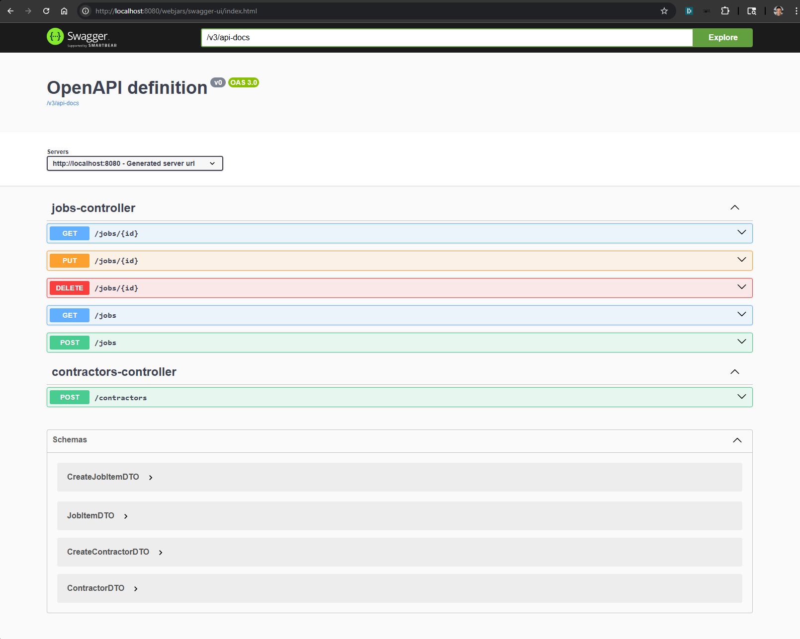

## Jobs Tracker Spring WebFlux Project

Demonstrate a Jobs Tracker REST application using Spring WebFlux and JAVA including a suggested folder solution to separate layers.

## Solution Structure

#### DynamoDB Dashboard

#### Kafka Dashboard

#### Services

##### References
https://docs.docker.com/guides/kafka/
https://kafka.apache.org/quickstart