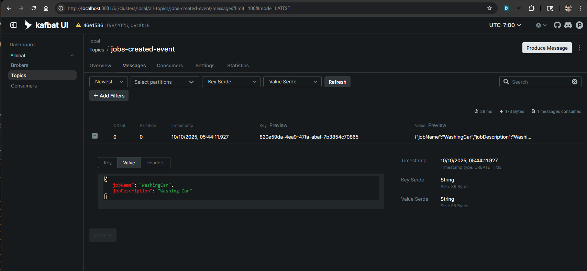

## Jobs Tracker Spring WebFlux Project

Demonstrate a Jobs Tracker REST application using Spring WebFlux and JAVA including a suggested folder solution to separate layers.
There is a version in .NET using C# https://github.com/andaro74/JobSolution

## Solution Structure

#### DynamoDB Dashboard

#### Kafka Dashboard

##### References
https://docs.docker.com/guides/kafka/
https://kafka.apache.org/quickstart